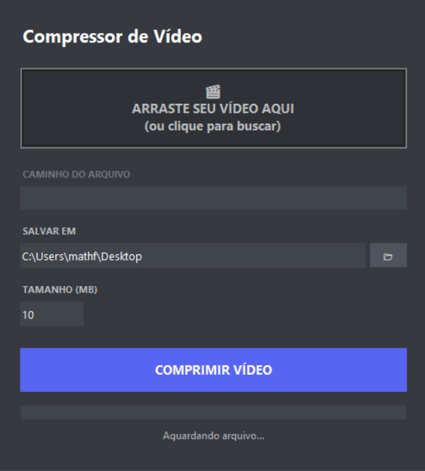

# 🎥 Video Compressor

[](https://github.com/mioj0kt/Video-Compressor/releases/latest)

Um aplicativo desktop em Python desenvolvido para comprimir vídeos automaticamente. Projetado com foco no limite de upload gratuito do Discord (10MB), mas permite personalizar o tamanho final do arquivo para qualquer valor em MB.

O projeto utiliza uma interface gráfica baseada em `Tkinter` e na potência do `FFmpeg` para realizar a compressão calculando o bitrate ideal.

<p align="center">
  
</p>

## ✨ Funcionalidades
- **☁️ Drag & Drop:** Arraste e solte arquivos de vídeo direto na interface.
- **🎯 Cálculo Automático:** Ajusta a taxa de bits (bitrate) baseada na duração para atingir o tamanho alvo exato.
- **🎨 Interface Moderna:** Tema escuro inspirado nas cores do Discord, com efeitos hover e design limpo.
- **📊 Progresso Real:** Barra de carregamento que mostra a porcentagem exata da conversão em tempo real.
- **⚙️ Customizável:** Permite alterar o tamanho alvo (MB) e a pasta de destino (padrão: Desktop).

## ⚠️ Pré-requisitos Obrigatórios
Este script **não funciona sozinho**. Ele atua como uma interface para o **FFmpeg**. Para rodar o projeto, você precisa seguir estes passos:

### 1. Ferramentas Externas (FFmpeg)
Como o FFmpeg é muito pesado para ser incluído no repositório, você deve baixá-lo manualmente:

1. Acesse o site de builds do FFmpeg (Recomendado: [gyan.dev](https://www.gyan.dev/ffmpeg/builds/)).
2. Baixe a versão "Essentials" (`ffmpeg-git-essentials.7z` ou `.zip`).
3. Abra o arquivo baixado e entre na pasta `bin`.
4. Copie os arquivos **`ffmpeg.exe`** e **`ffprobe.exe`**.
5. **Cole-os na raiz deste projeto** (na mesma pasta do arquivo `Main.py`).

### 2. Python e Bibliotecas
Você precisa ter o [Python 3.x](https://www.python.org/downloads/) instalado.

Instale as dependências do projeto executando no terminal:
```bash
pip install tkinterdnd2
```

## 🚀 Como Rodar
Após colocar os arquivos do FFmpeg na pasta e instalar as dependências:

1. Abra o terminal na pasta do projeto
2. Execute o comando:
   ```bash
   python Main.py
   ```

## 🛠️ Como criar um Executável
Se você deseja compilar o projeto para usar em computadores sem Python instalado, utilize o PyInstaller.

1. Instale o Pyinstaller:
   ```bash
   pip install pyinstaller
   ```
2. Execute o comando de build (necessário incluir a biblioteca de Drag&Drop explicitamente):
   ```bash
   pyinstaller --noconsole --onefile --collect-all tkinterdnd2 Main.py
   ```
3. O arquivo `.exe` será gerado na pasta `dist`. **Importante:** Lembre-se de colocar o `ffmpeg.exe` e o `ffprobe.exe` junto com o executável criado para que ele funcione.

## 🤝 Contribuição
Sinta-se à vontade para abrir Issues ou enviar Pull Requests para melhorar o código!

